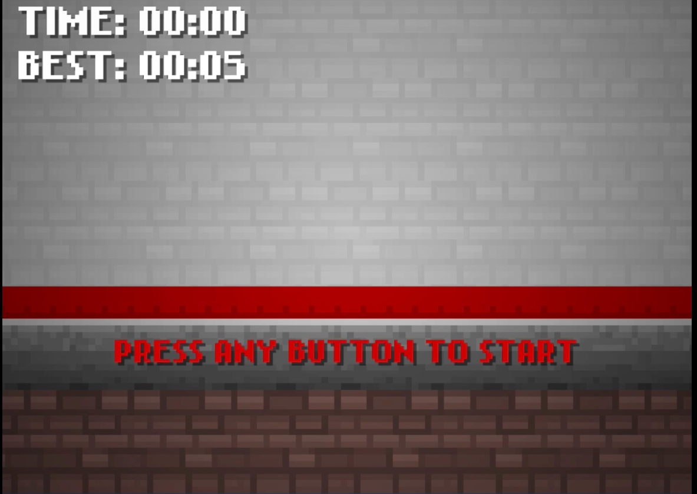
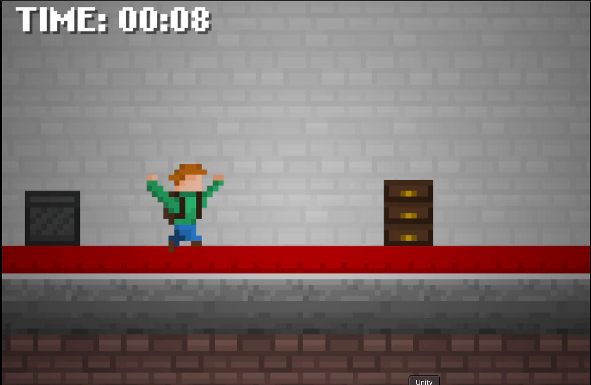
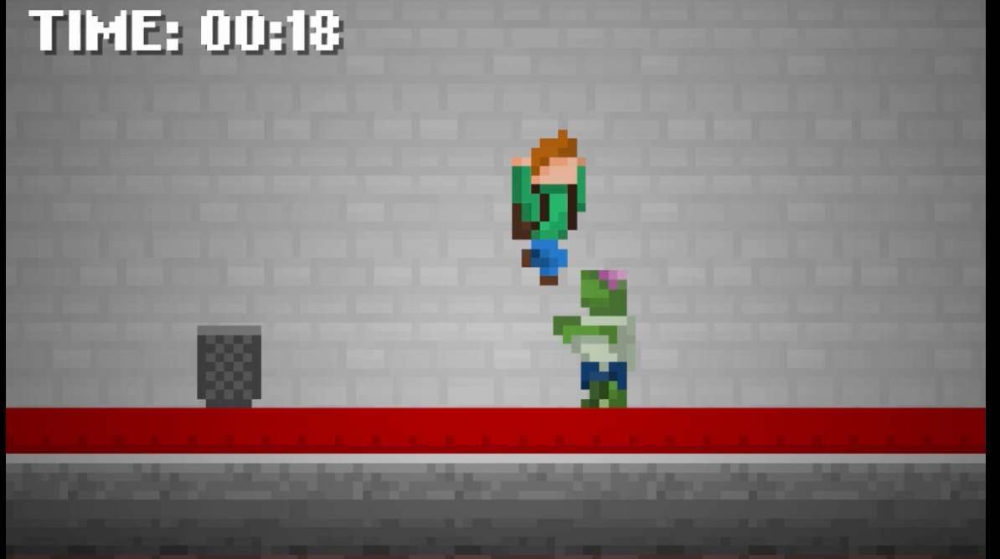

# Run From Zombie Game (Unity)

- It is my first Unity 2D game where you try to get over your obstacles and zombies
- Use C# and UnityEngine Library to write scripts for the logic behind the game.
- Explore the usage of C# and Unity framework for game development.

## Starting Screen



## Rules
- Goal: to jump over obstacles and zombies as long as you can
- Make sure you don't get push all the way to the end by those obstacles & zombies (It'll be game over)
- Press any key to start and jump
- Once the player is standing on an obstacle/zombie, the player will stop moving.
- You can press any button to respawn
- [Check out the demo on YouTube here](https://youtu.be/cybTgd0WyYo)


## Gameplay Screenshots





## For Development
- Clone this repository
- Go to ```Assets/Scripts/``` to see the source code
- Go to ```Assets/Scenes/``` to see the level design, menu, and credits scene
